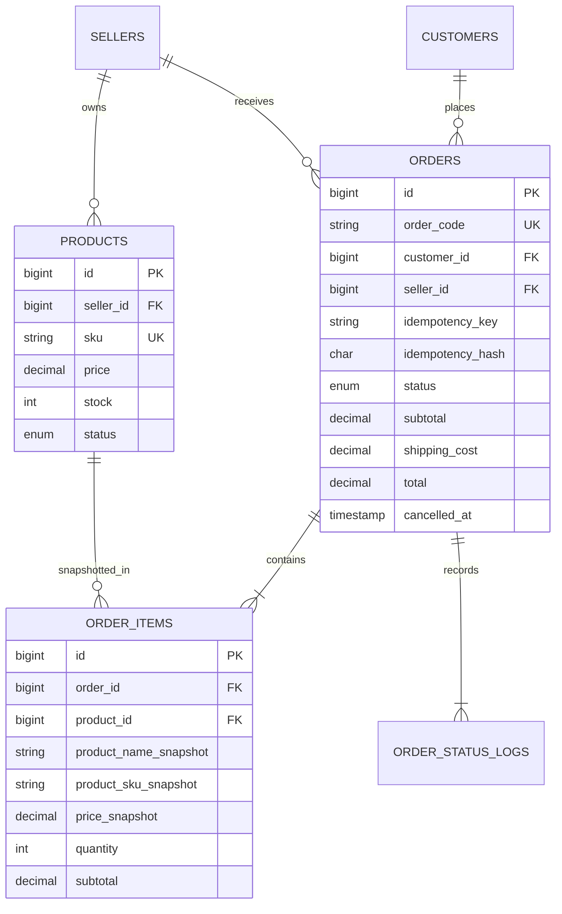

# Mini Order Checkout API

REST API Laravel 12 untuk technical test Backend Developer PT OkaIki Indonesia. API menangani katalog produk, checkout satu seller, pembatalan, dan konfirmasi pembayaran dengan transaksi database dan proteksi race condition.

## Kebutuhan

- PHP 8.2+
- Composer 2
- PostgreSQL 14+ (direkomendasikan dan telah diverifikasi)

SQLite dapat dipakai untuk development dan test, tetapi pengujian locking konkuren sebaiknya memakai MySQL/PostgreSQL karena SQLite tidak menyediakan row-level lock yang setara. Migration, seeder, dan feature test project ini telah diverifikasi pada PostgreSQL 16 serta SQLite.

## Instalasi

```bash
composer install
cp .env.example .env
php artisan key:generate
```

Atur koneksi PostgreSQL pada `.env`:

```dotenv
DB_CONNECTION=pgsql
DB_HOST=127.0.0.1
DB_PORT=5432
DB_DATABASE=backend_test
DB_USERNAME=postgres
DB_PASSWORD=password_postgresql_anda
```

Kemudian siapkan tabel dan data contoh:

```bash
php artisan migrate --seed
php artisan serve
```

Jika PostgreSQL belum tersedia, database dapat dijalankan melalui Docker:

```bash
docker compose up -d
```

Konfigurasi `.env.example` sudah cocok dengan container tersebut. Volume `postgres-data` menjaga data tetap tersedia setelah container dihentikan.

Seeder menyediakan data minimum yang memudahkan pengujian:

| Jenis | ID | Kondisi/penggunaan |
|---|---:|---|
| Customer | `1` | Customer demo untuk seluruh flow order |
| Seller | `10` | Seller utama dengan produk aktif, nonaktif, dan stok terbatas |
| Seller | `20` | Seller pembanding untuk menguji checkout beda seller |
| Produk | `101` | Aktif, stok cukup, harga `100000.00` |
| Produk | `102` | Aktif, stok cukup, harga `50000.00` |
| Produk | `103` | Nonaktif untuk menguji validasi status produk |
| Produk | `104` | Aktif dengan stok `1` untuk menguji stok terbatas |
| Produk | `201` | Aktif tetapi milik seller `20` untuk menguji seller berbeda |

Gunakan produk `101` dan `102` untuk checkout normal, produk `103` untuk error inactive, produk `104` dengan quantity lebih dari `1` untuk error stok, serta produk `201` bersama seller `10` untuk error beda seller. Order hasil checkout normal dapat langsung dipakai menguji endpoint cancel atau mark-paid.

Spesifikasi OpenAPI lengkap tersedia di [`docs/openapi.yaml`](docs/openapi.yaml).

## Postman Collection

File Postman Collection berada di:

```text
docs/Mini_Order_Checkout_API.postman_collection.json
```

File dapat dibuka langsung melalui tautan berikut: [`docs/Mini_Order_Checkout_API.postman_collection.json`](docs/Mini_Order_Checkout_API.postman_collection.json).

Cara menggunakannya:

1. Jalankan aplikasi dengan `php artisan serve`.
2. Buka Postman, kemudian pilih **Import**.
3. Pilih file `docs/Mini_Order_Checkout_API.postman_collection.json` dari root project.
4. Pastikan collection variable `base_url` bernilai `http://127.0.0.1:8000/api`.
5. Jalankan request **Checkout** terlebih dahulu. Script Postman akan menyimpan ID order hasil checkout ke variable `order_id` secara otomatis.
6. Gunakan request **Get Order**, **Cancel Order**, atau **Mark Order Paid**. Buat checkout baru jika ingin mencoba flow cancel dan paid secara terpisah.

Collection juga menyediakan request **Checkout Error - Different Seller** untuk membuktikan response validasi ketika item berasal dari seller lain. Nilai `Idempotency-Key` dibuat otomatis sebelum request checkout.

## Relasi database



Ringkasan tabel dan relasi:

| Tabel | Fungsi dan relasi |
|---|---|
| `customers` | Data customer; satu customer memiliki banyak order |
| `sellers` | Data seller; satu seller memiliki banyak produk dan order |
| `products` | Katalog milik seller, termasuk harga, stok, dan status aktif |
| `orders` | Header transaksi yang menghubungkan customer dengan satu seller |
| `order_items` | Detail produk dalam order beserta snapshot nama, SKU, dan harga |
| `order_status_logs` | Riwayat setiap perubahan status order dan actor yang melakukan perubahan |

Foreign key memakai kebijakan delete yang menjaga histori order. Kombinasi `order_id` dan `product_id` pada `order_items` dibuat unik, sedangkan `order_code`, SKU, dan email customer juga memiliki unique constraint.

## Endpoint

| Method | Endpoint | Keterangan |
|---|---|---|
| GET | `/api/products` | Produk aktif; filter opsional `seller_id` |
| GET | `/api/products/{id}` | Detail produk |
| POST | `/api/orders/checkout` | Membuat order pending payment |
| GET | `/api/orders/{id}` | Detail order, item snapshot, dan status log |
| POST | `/api/orders/{id}/cancel` | Membatalkan order pending dan mengembalikan stok |
| POST | `/api/orders/{id}/mark-paid` | Mengubah order pending menjadi paid |

Semua contoh berikut mengasumsikan aplikasi berjalan di `http://127.0.0.1:8000`.

```bash
# Daftar produk aktif
curl -H "Accept: application/json" http://127.0.0.1:8000/api/products

# Detail produk
curl -H "Accept: application/json" http://127.0.0.1:8000/api/products/101

# Detail order (ganti 1 dengan ID hasil checkout)
curl -H "Accept: application/json" http://127.0.0.1:8000/api/orders/1

# Batalkan order pending
curl -X POST -H "Accept: application/json" http://127.0.0.1:8000/api/orders/1/cancel

# Tandai order pending sebagai paid
curl -X POST -H "Accept: application/json" http://127.0.0.1:8000/api/orders/1/mark-paid
```

Contoh checkout:

```bash
curl -X POST http://127.0.0.1:8000/api/orders/checkout \
  -H "Accept: application/json" \
  -H "Content-Type: application/json" \
  -d '{
    "customer_id": 1,
    "seller_id": 10,
    "shipping_cost": 15000,
    "items": [
      {"product_id": 101, "quantity": 2},
      {"product_id": 102, "quantity": 1}
    ]
  }'
```

Contoh response produk:

```json
{
  "success": true,
  "message": "Detail produk berhasil diambil.",
  "data": {
    "id": 101,
    "seller_id": 10,
    "name": "Produk A",
    "sku": "SKU-A",
    "price": "100000.00",
    "stock": 10,
    "status": "active"
  }
}
```

Contoh response checkout berhasil (`201 Created`):

```json
{
  "success": true,
  "message": "Checkout berhasil dibuat.",
  "data": {
    "order_id": 1,
    "order_code": "ORD-20260714-A1B2C3D4",
    "customer_id": 1,
    "seller_id": 10,
    "status": "pending_payment",
    "subtotal": "250000.00",
    "shipping_cost": "15000.00",
    "total": "265000.00",
    "cancelled_at": null,
    "items": [
      {
        "product_id": 101,
        "product_name": "Produk A",
        "sku": "SKU-A",
        "price": "100000.00",
        "quantity": 2,
        "subtotal": "200000.00"
      },
      {
        "product_id": 102,
        "product_name": "Produk B",
        "sku": "SKU-B",
        "price": "50000.00",
        "quantity": 1,
        "subtotal": "50000.00"
      }
    ]
  }
}
```

Response cancel dan mark-paid memakai struktur order yang sama. Nilai `status` masing-masing menjadi `cancelled` atau `paid`; response cancel juga mengisi `cancelled_at`.

Semua response memakai envelope yang sama:

```json
{"success": true, "message": "...", "data": {}}
```

```json
{"success": false, "message": "...", "errors": {}}
```

Checkout sukses memakai HTTP `201`, error validasi/business rule memakai `422`, konflik transisi status memakai `409`, dan resource yang tidak ada memakai `404`.

Untuk mencegah double checkout akibat retry/double click, client dapat mengirim header `Idempotency-Key` (maksimal 100 karakter). Pengulangan key dan payload oleh customer yang sama mengembalikan order awal dengan HTTP `200` tanpa memotong stok lagi. Key yang dipakai ulang dengan payload berbeda ditolak dengan `409`. Checkout baru mengembalikan `201`.

Setiap pelanggaran validasi atau business rule menunjuk field yang bermasalah. Contoh ketika salah satu item berasal dari seller lain:

```json
{
  "success": false,
  "message": "Semua produk harus berasal dari seller yang dipilih.",
  "errors": {
    "items.0.product_id": [
      "Produk bukan milik seller yang dipilih."
    ]
  }
}
```

Contoh stok tidak mencukupi:

```json
{
  "success": false,
  "message": "Stok produk tidak mencukupi.",
  "errors": {
    "items.0.quantity": [
      "Stok tersedia hanya 1."
    ]
  }
}
```

## Keputusan desain

- Checkout, cancel, dan mark-paid seluruhnya berjalan dalam `DB::transaction`. Kegagalan item mana pun me-rollback order, item, log, dan perubahan stok.
- Produk dikunci dengan `SELECT ... FOR UPDATE` dan selalu dalam urutan ID yang sama. Request checkout paralel membaca stok terbaru setelah lock diperoleh sehingga stok tidak dapat oversold.
- Unique constraint `(customer_id, idempotency_key)` mencegah dua order dari retry checkout yang sama, termasuk saat request tiba bersamaan. Hash payload memastikan key tidak dapat dipakai ulang untuk checkout berbeda. Kedua kolom nullable agar client lama tetap dapat checkout tanpa key.
- Cancel dan mark-paid mengunci row order. Hanya transaksi pertama yang melihat `pending_payment`; request berikutnya mendapat `409`. Karena itu cancel berulang tidak dapat mengembalikan stok dua kali.
- Produk duplikat dalam payload ditolak dengan validasi `distinct`, bukan digabungkan diam-diam.
- Harga hanya dibaca dari database. Nama, SKU, dan harga disalin ke `order_items` agar histori tidak berubah saat data produk diperbarui.
- Perhitungan nominal menggunakan `Brick\\Math\\BigDecimal` dan kolom `decimal(15,2)`, tidak menggunakan float.
- `order_code` memakai format `ORD-YYYYMMDD-XXXXXXXX` dengan random suffix dan unique constraint database.
- Kolom `created_at`/`updated_at` ditambahkan pada customer, seller, dan product untuk audit standar Eloquent. Index komposit ditambahkan untuk query seller/customer dan status.
- Tabel `users`, `cache`, `jobs`, `job_batches`, dan `failed_jobs` adalah migration bawaan Laravel 12. Tabel tersebut dipertahankan untuk kompatibilitas authentication, cache, dan queue framework, tetapi tidak dipakai oleh flow checkout.
- Autentikasi tidak ditambahkan karena tidak diminta dalam scope. Identitas actor pada log berasal dari customer order atau system.

## Checklist requirement

| Requirement technical test | Implementasi |
|---|---|
| Migration, model, relationship, seeder | Enam tabel domain, seluruh relasi Eloquent, dan data contoh dengan ID sesuai payload brief |
| Enam endpoint wajib | Terdaftar di `routes/api.php` dan didokumentasikan di OpenAPI/Postman |
| Satu seller per checkout | Diverifikasi setelah product rows dikunci |
| Customer/seller tersedia | `exists` validation pada form request |
| Produk aktif, quantity minimal 1, tanpa duplikat | Form request dan business-rule validation |
| Stok mencukupi dan aman dari race condition | `lockForUpdate`, stable lock ordering, dan validasi stok di dalam transaction |
| Harga wajib dari database | Payload harga tidak dipakai dan diuji eksplisit |
| Perhitungan nominal akurat | `decimal(15,2)` dan `BigDecimal`; tidak memakai float |
| Order, item snapshot, stok, dan initial log atomik | Satu database transaction; test memastikan rollback total saat salah satu item gagal |
| Cancel hanya dari pending dan stok kembali sekali | Order row lock, transaction, `cancelled_at`, serta status log |
| Paid hanya dari pending dan tidak dapat diulang | Order row lock, transaction, serta status log |
| Double checkout | Header opsional `Idempotency-Key`, payload hash, dan unique constraint |
| Response konsisten | Envelope success/error untuk validation, business rule, 404/405, dan internal error |
| Testing dan dokumentasi | Feature test, README, ERD, OpenAPI, Postman, dan Docker Compose |

## Test

```bash
php artisan test
```

Feature test mencakup checkout sukses, snapshot dan perhitungan total, rollback saat stok kurang, seluruh validasi utama, idempotency key, double checkout pada stok terbatas, cancel dan pengembalian stok idempotent, transisi paid, status log, katalog, serta format error 404/405.

Test dapat diarahkan ke PostgreSQL tanpa menyimpan password di repository dengan mengatur environment variable `DB_CONNECTION`, `DB_HOST`, `DB_PORT`, `DB_DATABASE`, `DB_USERNAME`, dan `DB_PASSWORD` sebelum menjalankan `php artisan test`. Set `EXPECTED_DB_DRIVER=pgsql` untuk mengaktifkan assertion eksplisit bahwa test runner benar-benar memakai PostgreSQL.
